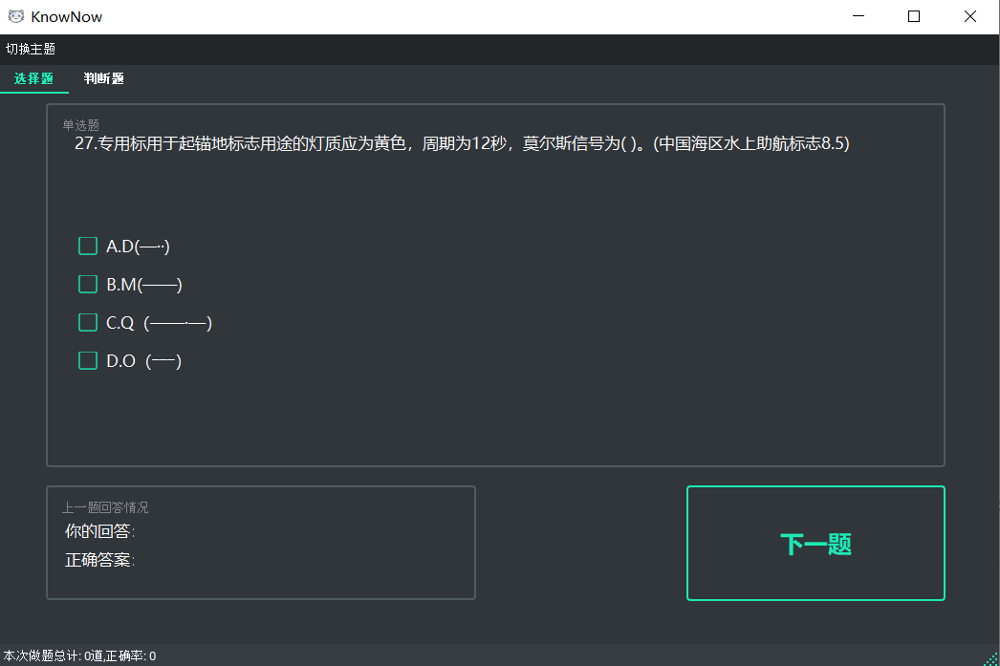
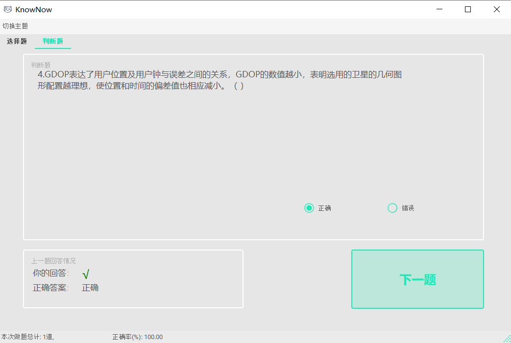
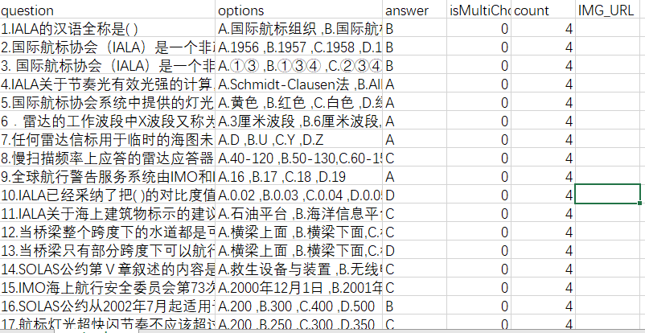

# KnowNow(闹闹)


## Introduction

This project is designed for daily practice of skills in a specific field, especially exam questions. It supports single-choice, multiple-choice, and true/false questions. Users can also customize their own question banks for practice.

## Software Architecture

User Interface: PyQt5

Data Processing: pandas

## Screenshots





## Installation

```python
pip install pandas

pip install PyQt5

pip install qt-material
```

## Usage

You can also use the packaged windows executable program

```python
python main.py
```


## Custom Questions

Modify the csv file under the **/data** folder

CSV storage format for multiple-choice questions:

| question             | options     | answer | isMultiChoice | count | IMG_URL  |
| -------------------- | ----------- | ------ | ------------- | ----- | -------- |
| Question Description | A xxx,B xxx | ABC    | 0 or 1        | 4     | \img\xxx |

- Fill the 'question' [string] field with the question description.
- Fill the 'answer' [string] field with uppercase letters for the correct answer.
- Fill the 'options' [string] field with the options, each option separated by a comma.
- Fill the 'isMultiChoice' [int] field with 0 for single-choice or 1 for multiple-choice.
- Fill the 'IMG_URL' [string] field with the relative path of the image, and place the image in the 'img' folder.

For example:




## Todo

Improve the picture display function of the problem

## 软件介绍

该项目用于日常练习某领域技能，尤其是考试题目，支持单选题、多选题和判断题。支持用户自定义题库练习。

## 软件架构

用户界面： PyQt5

数据处理： pandas 

## 截图


## 安装

```python
pip install pandas

pip install PyQt5

pip install qt-material
```

## 使用

也可以使用打包好的windows可执行程序

```python
python main.py
```


## 自定义题库

选择题（包含多选题的csv存储格式：

| question | options     | answer | isMultiChoice | count | IMG_URL  |
| -------- | ----------- | ------ | ------------- | ----- | -------- |
| 问题描述 | A xxx,B xxx | ABC    | 0 或 1        | 4     | \img\xxx |

* question[string] 字段填入问题描述
* answer[string] 字段全部填入大写字母
* options[string] 字段填入选项，每个选项用逗号隔开的字符串
* isMultiChoice[int] 字段填0或1，0表示单选，1表示多选
* IMG_URL[string] 字段填入图片的路径，将图片放入img文件夹中的相对路径

例如:


